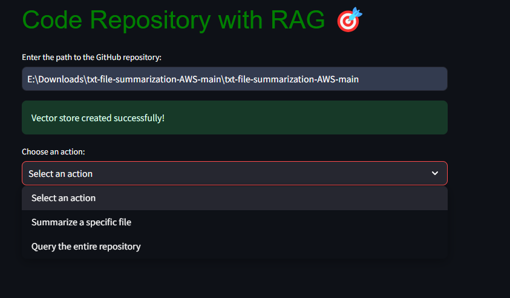
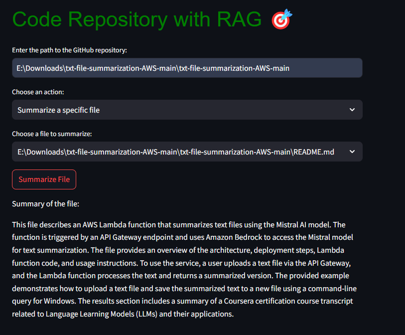
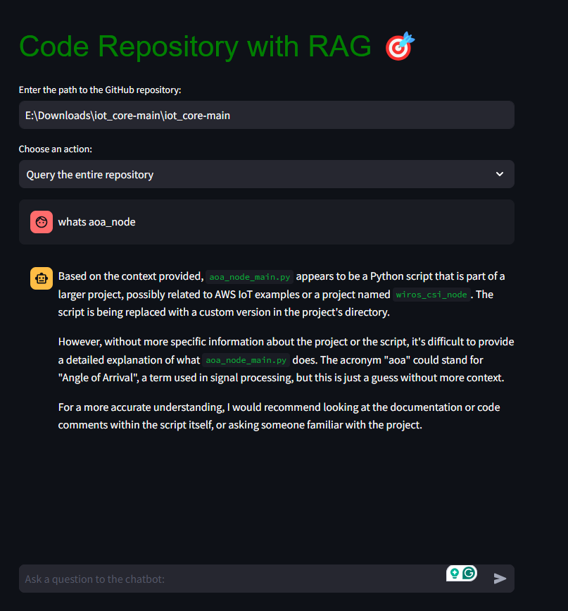

# repository-querying-using-RAG

# Code Repository with Retrieval-Augmented Generation (RAG) 🎯

## Overview

This project allows you to interact with a GitHub code repository using a Retrieval-Augmented Generation (RAG) system. It provides two key functionalities: summarizing specific files and querying the repository content using a chatbot with memory. The system leverages Amazon Titan embeddings, FAISS vector search, and Mistral AI through Amazon Bedrock for its operations. 
Note: For now you need to .git clone the repos to your pc to use them.

## Features

1. **Download and Process GitHub Repositories**: 
   - The project takes the path to a GitHub repository as input.
   - It breaks down the content into chunks, converts them to embeddings using Amazon Titan, and stores them in a FAISS vector store for fast similarity search.
   - Choose which action to take: summarize a file or query the database using RAG


2. **Summarize Files**:
   - Lists all sub-files in the repository.
   - Allows the user to select any file to generate a summary. The file data is sent to Mistral AI (via Amazon Bedrock) to provide an AI-generated summary.



3. **Query the Repository with a Chatbot**:
   - A chatbot interface lets users query the entire repository.
   - It performs a similarity search on the vector store and sends relevant results along with the user's query to Mistral AI.
   - The chatbot has memory, meaning it remembers previous conversations and provides responses with context-aware answers.
   - not only that it actually improves the results for the RAG by using the knowledge base of MinstralAI


## Architecture


### 1. **Vector Store Creation**:
   - When a path to a GitHub repository is provided, the project breaks down the content of the files into smaller chunks.
   - These chunks are converted into embeddings using **Amazon Titan embeddings**.
   - The embeddings are stored in a **FAISS vector store** for fast and efficient similarity search during querying.

### 2. **Summarizing Files**:
   - The user can select any sub-file from the repository to summarize.
   - The file's data is processed and sent to **Mistral AI** (via **Amazon Bedrock**), which generates a summary of the file.

### 3. **Querying the Repository**:
   - When querying, the project uses **RAG (Retrieval-Augmented Generation)**.
   - It performs a **similarity search** in the FAISS vector store to retrieve relevant results.
   - Both the retrieved results and the user’s query are sent to **Mistral AI**, which generates a detailed response.
   - The chatbot has **memory**, so it keeps track of previous conversations and can reference earlier context when generating responses.

## Setup

### Prerequisites

- Python 3.7+
- Required Python packages listed in `requirements.txt` (`langchain`, `FAISS`, `streamlit`, etc.) 
- AWS credentials configured for accessing Amazon Bedrock

### Installation

1. Clone this repository:
    ```bash
    git clone https://github.com/your-repo-name.git
    ```

2. Navigate to the project directory:
    ```bash
    cd your-repo-name
    ```

3. Install the required packages:
    ```bash
    pip install -r requirements.txt
    ```

## Usage

### Running the Streamlit App

1. Run the following command to start the Streamlit app:
    ```bash
    streamlit run rag_frontend.py
    ```

2. You will see the web interface where you can enter the GitHub repository path and choose actions like summarizing files or querying the repository.

### Frontend Features

- **Enter Repository Path**: Enter the path of the GitHub repository you want to analyze.
- **Summarize Specific File**: Select a file from the list, click "Summarize," and the system will generate a concise summary of the file's contents.
- **Query the Repository**: Ask a question about the repository, and the chatbot will respond with context-aware answers based on the documents.

## Example Workflow

1. **Provide the Repository Path**: Enter the path of the GitHub repository you want to explore.
   
2. **Summarize a Specific File**: Choose a file from the list, click "Summarize," and the system will generate a summary of the file’s content using Mistral AI.
   
3. **Query the Repository**: Ask a question about the repository. The chatbot performs a similarity search using FAISS and sends the results and query to Mistral AI to generate a response. The chatbot also remembers previous interactions to provide more accurate answers.


